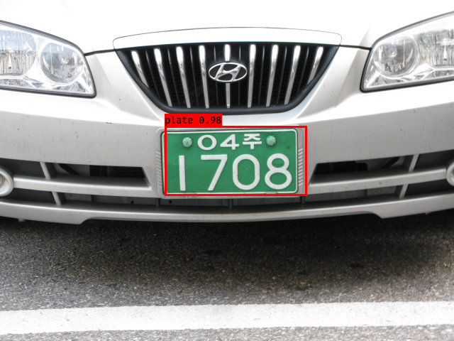

# keras-yolo3

## Introduction

A keras implementation of YOLOv3 (Tensorflow backend) for car plate detection (ref: [qqwweee/keras-yolo3](https://github.com/qqwweee/keras-yolo3))

## How to use:

### 1) Get the model

Step 1: Download the project:
```
git clone https://github.com/12rics/plateDetectionYolo3.git
```

Step 2: Download the model [plate.h5](https://drive.google.com/open?id=1a7SdZqNH2Ueh0Ohr-oRwftGPKIC3RNXm) to directory directly.

### 2) Test the model on image
Run YOLO detection.
```
python yolo_video.py --model_path plate.h5 --classes_path class.txt --image
```
then input filepath.


### 3) Test the model on video

Run YOLO detection.
```
python yolo_video.py --model_path plate.h5 --classes_path class.txt --input input_video.mp4 --output output_video.mp4
```
